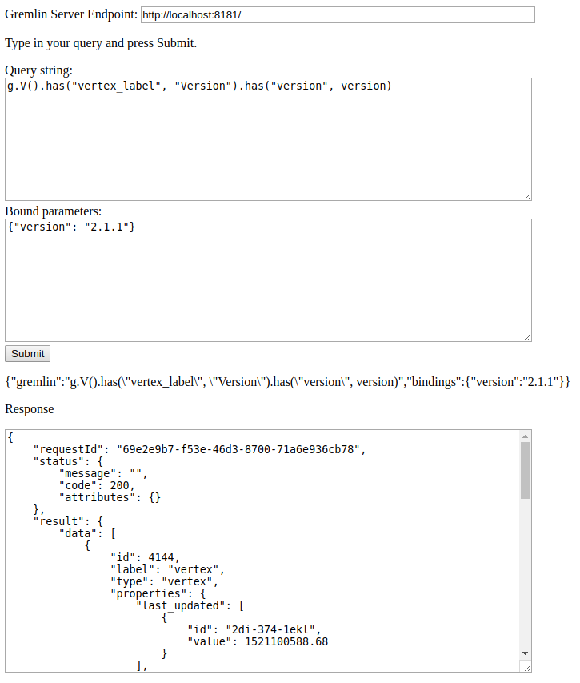

How to use?

```
python -mSimpleHTTPServer 8080
```

Now visit http://localhost:8080/ , 

 * enter Gremlin Server URL on top text box
 * type Gremlin Query in the provided textarea and
 * press Submit button.

This should return the Query results formatted in Response area.




